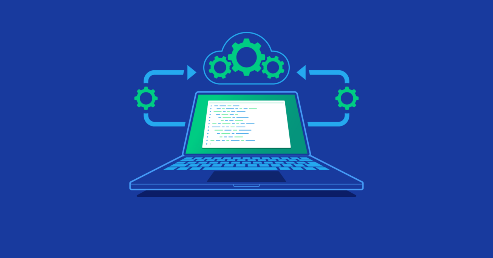

<!-- Improved compatibility of back to top link: See: https://github.com/othneildrew/Best-README-Template/pull/73 -->

<!--
*** Thanks for checking out the Best-README-Template. If you have a suggestion
*** that would make this better, please fork the repo and create a pull request
*** or simply open an issue with the tag "enhancement".
*** Don't forget to give the project a star!
*** Thanks again! Now go create something AMAZING! :D
-->

<!-- PROJECT SHIELDS -->
<!--
*** I'm using markdown "reference style" links for readability.
*** Reference links are enclosed in brackets [ ] instead of parentheses ( ).
*** See the bottom of this document for the declaration of the reference variables
*** for contributors-url, forks-url, etc. This is an optional, concise syntax you may use.
*** https://www.markdownguide.org/basic-syntax/#reference-style-links
-->
[![Issues][issues-shield]][issues-url]

<!-- PROJECT LOGO -->
 

  

  <h3 align="center">Starting-Study_Project</h3>

  

    Project carried out during my high school studies!
     
    <a href="https://github.com/Soonnova/Study_Project/docs.md"><strong>Explore the docs »</strong></a>
     
     
    <a href="https://www.youtube.com/watch?v=dQw4w9WgXcQ">View Demo</a>
    ·
    <a href="https://github.com/soonnova/Study_Project/issues">Report Bug</a>
    ·
    <a href="https://github.com/soonnova/Study_Project/issues">Request Feature</a>
  

<!-- TABLE OF CONTENTS -->

  
Table of Contents

  <ol>
    <li>
      <a href="#about-the-project">About The Project</a>
      <ul>
        <li><a href="#built-with">Built With</a></li>
      </ul>
    </li>
    <li>
    <li><a href="#roadmap">Roadmap</a></li>
    <li><a href="#contributing">Contributing</a></li>
    <li><a href="#license">License</a></li>
    <li><a href="#contact">Contact</a></li>
  </ol>

<!-- ABOUT THE PROJECT -->
## About The Project

TThis is a post about work carried out at school, a two-year project, there are 3 of us preparing it to present it orally for 15 minutes each at the end of the school year.

Use the `docs.md` to get started.

(<a href="#readme-top">back to top</a>)

### Built With

This section should list any major frameworks/libraries used to bootstrap your project. Leave any add-ons/plugins for the acknowledgements section. Here are a few examples.

- Soon..

(<a href="#readme-top">back to top</a>)

<!-- ROADMAP -->
## Roadmap

- [x] Add Changelog
- [x] Add back to top links
- [ ] Add Additional files
- [ ] Starting project
- [ ] Add different language
    - [ ] French
    - [ ] Spanish

(<a href="#readme-top">back to top</a>)

<!-- CONTRIBUTING -->
## Contributing

# ⛏ Study_Project [In Progress..]
# Thanks to
1. Teatchers to help and advice
2. Classmates for advice
3. And mainly to the students of my groups

(<a href="#readme-top">back to top</a>)

## Contact

- Discord : soon59
- Discord : Other participant
- Discord : Other participant

(<a href="#readme-top">back to top</a>)

